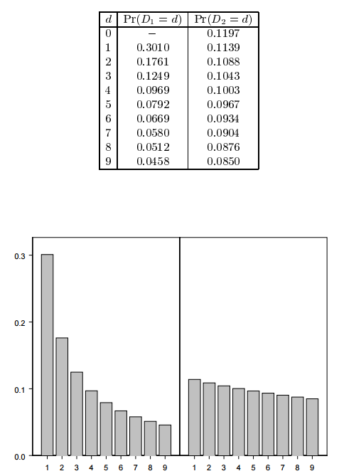

************
Introduction
************

.. contents:: Table of Contents
   :depth: 2

Background
==========
Benford's Law was first published by American astronomer Simon Newcomb in a paper entitled "Note on the Frequency of Use of the Different Digits in Natural Numbers", which appeared in The American Journal of Mathematics (1881) 4, 39-40. It was re-discovered by Frank Benford in 1938, and he published an article called "The Law of Anomalous Numbers" in Proc. Amer. Phil. Soc 78, pp 551-72.

Benford's Law
=============
Specifically, in data sets, the leading digit(s) is (are) distributed in a specific, nonuniform way. While one might think that the number 1 would appear as the first digit 11 percent of the time (i.e., one of nine possible numbers), it actually appears about 30 percent of the time. Nine, on the other hand, is the first digit less than 5 percent of the time. The theory covers the first digit, second digit, first two digits, last digit and other combinations of digits because the theory is based on a logarithm of probability of occurrence of digits.

Graphical summary
-----------------
Benford's Law is summarized below in tabular and graphical format for the first two digits of the numbers being observed.

Intuitive Explanation
---------------------
An excellent intuitive explanation of the phenomenon is provided here: `How / Why does it work? <http://datagenetics.com/blog/march52012/index.html>`_

.. NOTE::

    Although Simon Newcomb first reported the phenomenon, it is called Benford's law in honor of Frank Benford who re-discovered it later.
